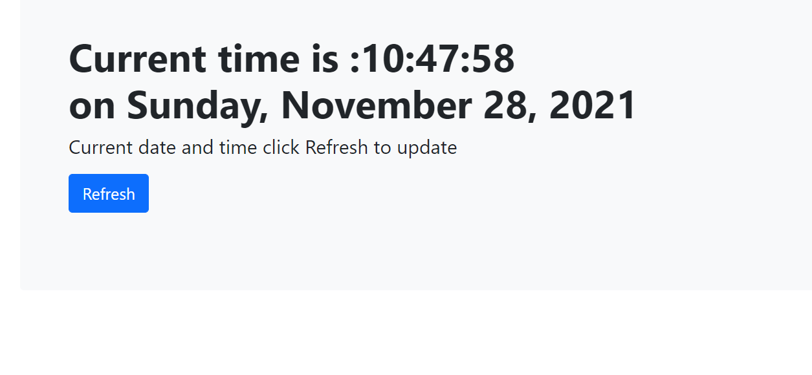

# Clock 

**It is a simple Javascript project which displays the current/live date and time**

### Languages used : 

### How to use :
- use command `git clone <url>` to clone the files
- Copy path of `index.html` and paste in google to run the site or use live share(extension of VScode recommended) 

### Screenshots :
